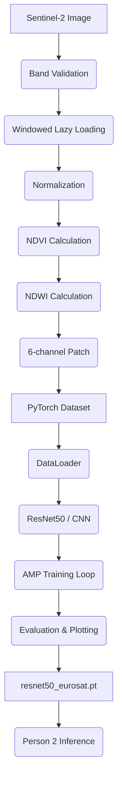

# Project Overview

This project provides an automated pipeline for acquiring, preprocessing, and classifying multi-spectral Sentinel-2 satellite imagery, specifically using the EuroSAT land cover dataset. It translates raw, multi-band (13-band) geographic data into memory-efficient 6-channel tensors, and trains deep learning architectures (Baseline CNN and ResNet50) to classify patches into land-use categories. The pipeline is designed to be highly memory-efficient for local development (Antigravity IDE) and compatible with Google Colab for GPU-accelerated training.

# Folder Structure

```text
geo_sat_project/
├── data/
│   ├── raw/
│   │   ├── sentinel2/       # Raw Sentinel-2 downloads
│   │   └── eurosat/         # Downloaded EuroSAT dataset
│   └── preprocessed/        # Extracted 6-channel patches (H,W,6)
├── dummy_dataset/           # Dummy data for demonstration
├── models/                  # Checkpoints, logs, and evaluation metrics
├── notebooks/
│   ├── eurosat_visualization.ipynb
│   └── data_pipeline.ipynb
├── scripts/
│   ├── download_sentinel.py # Sentinel-2 downloader
│   └── download_eurosat.py  # EuroSAT downloader
├── src/
│   └── preprocessing/
│       └── preprocess.py    # Core raster preprocessing logic
├── training/
│   ├── config.py            # Global hyperparameters
│   ├── dataset.py           # PyTorch Dataset & DataLoader
│   ├── evaluate.py          # Validation metrics & visualizations
│   └── model.py             # CNN and ResNet50 definitions
│   └── train.py             # Training loop, AMP, Checkpointing
├── README.md
├── requirements.txt
├── test_pipeline.py
└── train_colab.ipynb        # Phase 3 orchestration for Colab
```

# Technologies Used

- **Data Processing:** `numpy`, `rasterio`, `geopandas`, `shapely`
- **Machine Learning:** `torch`, `torchvision`, `scikit-learn`
- **Visualization:** `matplotlib`, `seaborn`
- **Data Acquisition:** `sentinelsat`, `requests`
- **Monitoring:** `psutil`, `tqdm`

# Phase 1 Walkthrough

- **Purpose**: Authenticate, download, and visually explore raw satellite data.
- **Files**:
  - `requirements.txt`: Project dependencies.
  - `scripts/download_sentinel.py`: Queries and downloads low-cloud-cover Sentinel-2 tiles via Copernicus Data Space Ecosystem.
  - `scripts/download_eurosat.py`: Safely fetches and extracts the multi-spectral EuroSAT zip file.
  - `notebooks/eurosat_visualization.ipynb`: Explores the dataset by visualizing True-Color (RGB) and False-Color (NIR) composites.
- **Workflow**:
  1. The user installs requirements.
  2. The download scripts pull the raw datasets into `data/raw/`.
  3. The visualization notebook reads individual bands to verify data integrity and highlights the importance of the NIR band for vegetation.
- **Outputs**: Raw `.tif` files and zip extractions in the `data/raw/` directory.

# Phase 2 Walkthrough

- **Purpose**: Transform massive satellite rasters into normalized, 6-channel model-ready patches without exceeding RAM limits.
- **Files**:
  - `src/preprocessing/preprocess.py`: Contains `validate_bands`, `load_bands`, `normalize_and_stack`, and `extract_patches`.
  - `training/dataset.py`: Defines the PyTorch `SatelliteDataset` and `get_data_loaders`.
  - `notebooks/data_pipeline.ipynb`: Interactive demonstration of the memory profile and DataLoader pipeline.
- **Workflow**:
  1. **Band Validation**: Checks for spatial consistency (CRS, Transform, Dimensions) across bands.
  2. **Lazy Loading**: `load_bands` uses `rasterio.windows.Window` to read specific geographical subsets rather than the whole image.
  3. **NDVI Calculation**: `(NIR - Red) / (NIR + Red + 1e-6)`
  4. **NDWI Calculation**: `(Green - NIR) / (Green + NIR + 1e-6)`
  5. **Patch Extraction**: A generator yields 6-channel patches (Blue, Green, Red, NIR, NDVI, NDWI). Memory is manually freed (`del`, `gc.collect()`) after every patch.
  6. **Dataset Creation**: `SatelliteDataset` acts as an `ImageFolder` but reads `.npy`/`.tif` arrays and safely converts them to `float32` tensors.
  7. **DataLoader**: `get_data_loaders` handles 70/15/15 randomized splits and constructs multi-threaded data loaders.
- **Outputs**: Preprocessed 6-channel `.npy` patches and initialized PyTorch DataLoaders.

# Phase 3 Walkthrough

- **Purpose**: Train, validate, and evaluate deep learning architectures on the preprocessed patches.
- **Files**:
  - `training/config.py`: Centralized hyperparameters (Epochs, LR, Batch Size).
  - `training/model.py`: Architecture definitions.
  - `training/train.py`: Main training loop.
  - `training/evaluate.py`: Evaluation and metric reporting.
  - `train_colab.ipynb`: Orchestrates Phase 3 for Google Colab GPU instances.
- **Workflow**:
  1. **CNN / ResNet50 Setup**: `get_resnet50` initializes a pretrained model. It explicitly alters the first conv layer to accept 6 channels, initializing the new channels with the mean of the original RGB weights.
  2. **Training**: Uses Automatic Mixed Precision (`autocast`, `GradScaler`) to halve VRAM usage. Optimizes with `AdamW` and `CosineAnnealingLR`.
  3. **Early Stopping & Checkpoints**: The script tracks Validation Loss. If it doesn't improve for 5 epochs, training halts. The best model is saved to `[model_name]_best.pt`.
  4. **Evaluation**: Generates classification reports, confusion matrices, and One-vs-Rest ROC curves.
- **Outputs**: `models/resnet50_best.pt`, `models/resnet50_history.json`, and `.png` evaluation graphs.

# Complete Project Workflow



# Memory Optimization Strategy

1. **Windowed Reading:** Instead of loading full Sentinel-2 tiles (often >10,000x10,000 pixels), `rasterio.windows.Window` parses only the `64x64` needed at a time.
2. **Generators:** Patch extraction uses the `yield` keyword so the full array of extracted patches never resides in memory simultaneously.
3. **Data Types:** NumPy arrays are explicitly cast to `float32` prior to tensor conversion, avoiding `float64` bloat.
4. **Garbage Collection:** Heavy usage of explicit `del` followed by `gc.collect()` at the end of generator iterations and training loops.
5. **AMP (Automatic Mixed Precision):** Cuts GPU memory usage by casting activations and gradients to `float16` during the forward and backward passes.

# Google Colab Workflow

1. Upload the `geo_sat_project` folder to Google Drive.
2. Open `train_colab.ipynb` and ensure the Runtime Type is set to GPU.
3. Run the notebook. It will mount the Drive, add the root directory to `sys.path`, install dependencies, and run `train_model` automatically.

# Local Development Workflow

1. Clone repo, instantiate a virtual environment (`python -m venv venv`), and activate it.
2. Run `pip install -r requirements.txt`.
3. Use the Antigravity IDE to execute notebooks in `notebooks/` and review Phase 1/Phase 2 pipelines.
4. Execute training locally via: `python training/train.py --data_dir data/preprocessed --model resnet50`.

# Person 2 Integration Guide

Person 2 (the downstream developer) is expected to utilize the trained models for inference without modifying the underlying architecture.

### Files Provided to Person 2
1. `models/resnet50_best.pt`: The trained model weights.
2. `training/model.py`: Contains `get_model("resnet50", num_classes=10)`.
3. `training/config.py`: Needed for shared parameters like `NUM_CLASSES`.
4. `src/preprocessing/preprocess.py`: Needed if Person 2 must preprocess raw Sentinel `.tif` imagery into 6-channel tensors before inference.

### Files Person 2 Should NEVER Modify
- `training/model.py` (Modifying this will break `state_dict` compatibility)
- `src/preprocessing/preprocess.py` (Modifying the channel order or formulas will invalidate the trained weights)

### Functions Person 2 Should Call
- **To instantiate the model**: `from training.model import get_model; model = get_model("resnet50")`
- **To load weights**: `model.load_state_dict(torch.load("models/resnet50_best.pt")['model_state_dict'])`
- **To preprocess data**: `from src.preprocessing.preprocess import load_bands, normalize_and_stack`

### Expected Inputs (Inference)
- A float32 PyTorch Tensor of shape `[Batch, 6, H, W]` representing (Blue, Green, Red, NIR, NDVI, NDWI).

### Expected Outputs (Inference)
- A PyTorch Tensor of shape `[Batch, 10]` containing unnormalized logits. Person 2 must apply `torch.softmax(outputs, dim=1)` and `torch.argmax` to resolve final class probabilities.

# Project Deliverables
- Functional data extraction and exploration module (Phase 1).
- Memory-efficient preprocessing generator and PyTorch Dataset (Phase 2).
- AMP-enabled ResNet50/CNN Training architecture and Evaluation tools (Phase 3).
- Master Walkthrough Documentation.

# Known Limitations
- Requirements lack explicit version pinning (e.g., `torch==2.0.1`), which may cause drift in the future.
- `random_split` is used instead of a stratified split, which is fine for the relatively balanced EuroSAT but could be improved for highly imbalanced satellite datasets.

# Future Improvements
- Pin all dependencies in `requirements.txt`.
- Implement `StratifiedShuffleSplit` in `dataset.py` for guaranteed class distribution.
- Include data augmentation strategies that explicitly leverage the multi-spectral channels without distorting indices.
